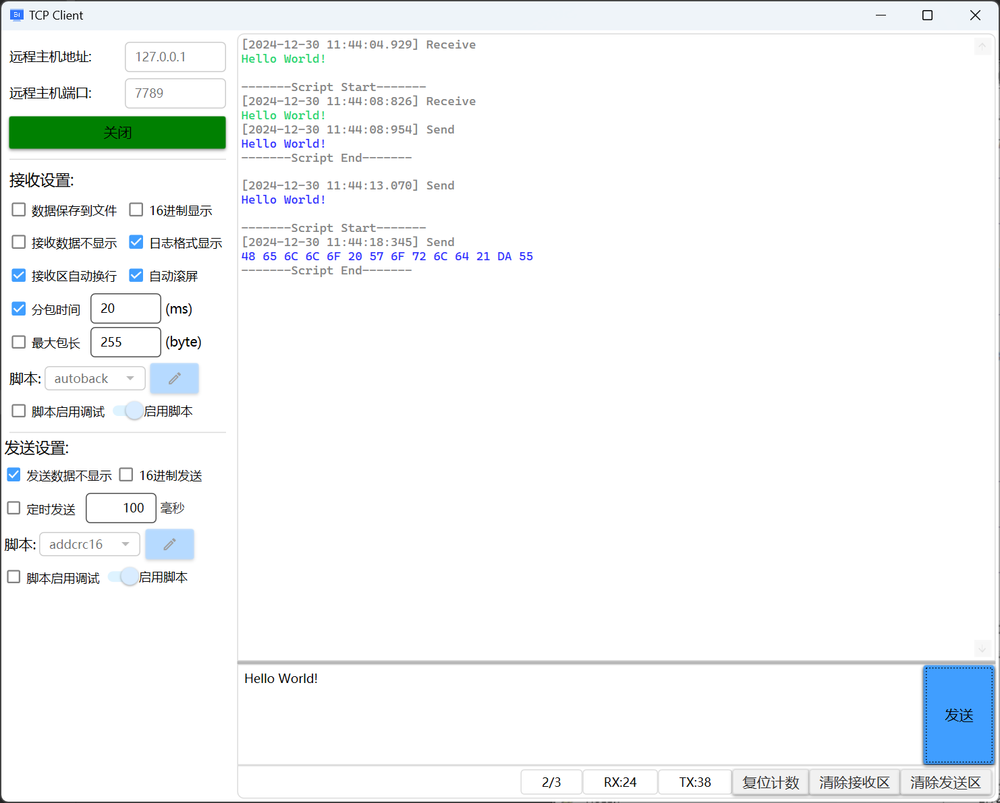
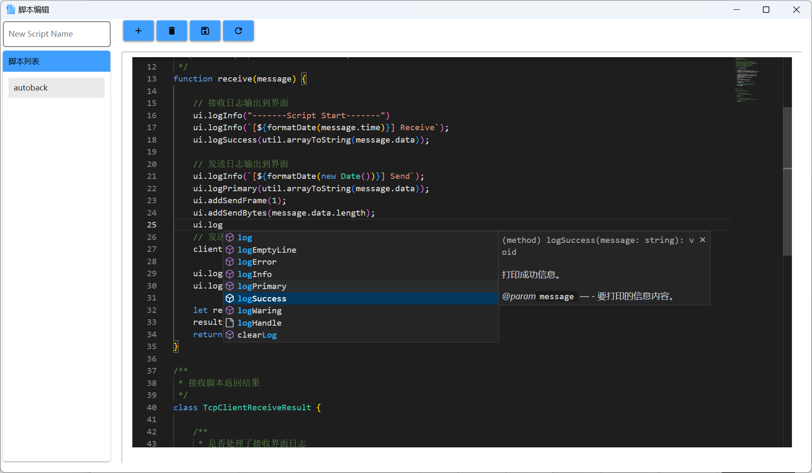
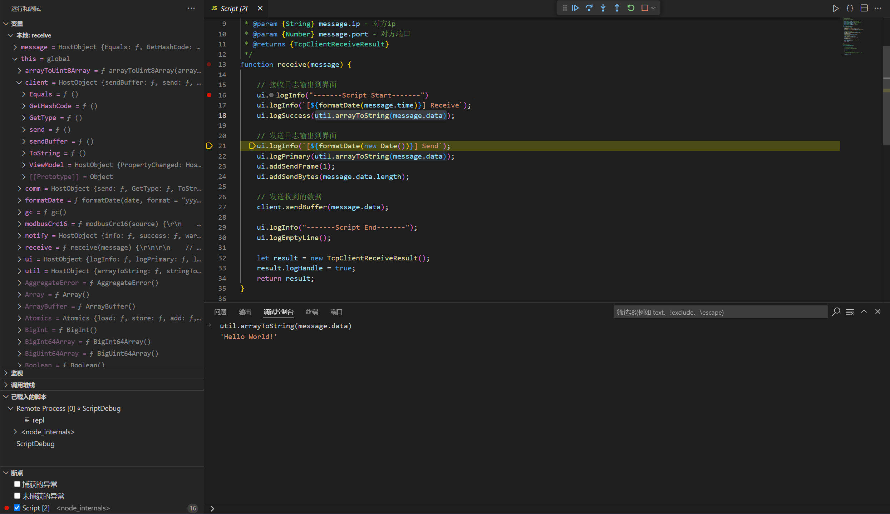

## 简介

`WPF`  + `Blazor ` 实现的通信测试工具，支持JS脚本、脚本调试、内置vscode代码编辑器，编写脚本代码有智能提示

## 技术点

* WPF
* Blazor
* MVVM
* IOC
* Monaco

## 功能支持

* 串口
* Tcp客户端
* Tcp服务端
* Udp
* 定时发送
* 超长文本显示
* 快速接收不卡界面
* Js 脚本
* 脚本编辑
* 脚本编辑智能提示

## 脚本支持

使用 `ClearScript` 作为脚本引擎，支持.Net对象注入，脚本中调用.Net方法，VsCode调试

* [脚本对象说明 ](./document/脚本定义.md)
* [脚本调试方法](./document/使用VsCode进行脚本调试.md)
* [串口接收脚本示例](./Comm.WPF/scripts/common/template_SerialReceive.js)
* [串口发送脚本示例](./Comm.WPF/scripts/common/template_SerialSend.js)
* [TcpClient接收脚本示例](./Comm.WPF/scripts/common/template_TcpClientReceive.js)
* [TcpClient发送脚本示例](./Comm.WPF/scripts/common/template_TcpClientSend.js)
* [TcpServer接收脚本示例](./Comm.WPF/scripts/common/template_TcpServerReceive.js)
* [TcpServer发送脚本示例](./Comm.WPF/scripts/common/template_TcpServerSend.js)
* [Udp接收脚本示例](./Comm.WPF/scripts/common/template_UdpReceive.js)
* [Udp发送脚本示例](./Comm.WPF/scripts/common/template_UdpSend.js)

## 下载方法

```bash
git clone --recurse-submodules https://github.com/daoyull/CommTool.git
```

下载并初始化子模块后可直接运行

## 打包方法

运行 `publish.bat` 会把项目打包到同一文件夹

## 部分截图

### 基础界面



### 脚本编辑



### 脚本调试

